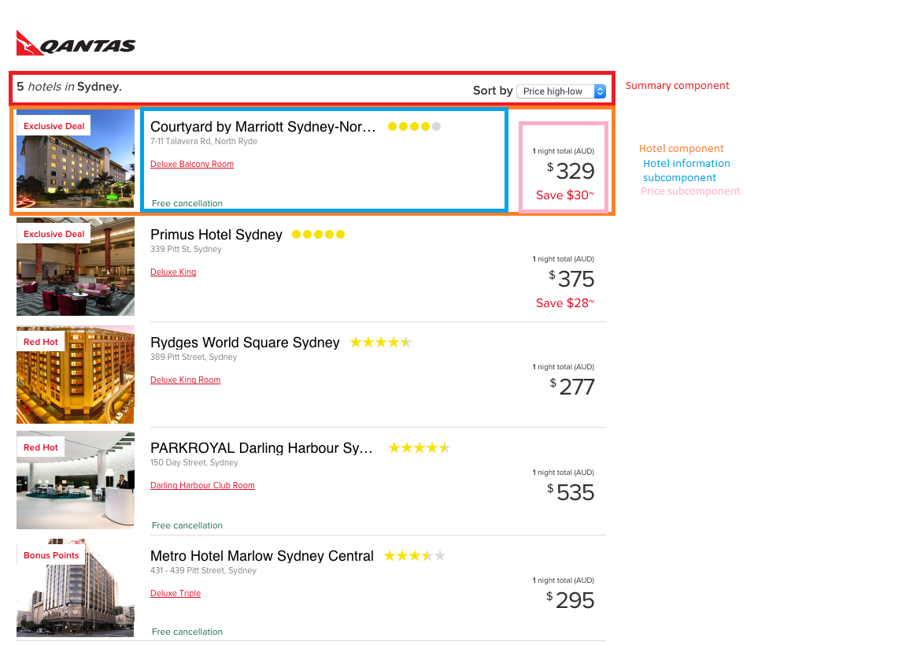

### How to run

Built using Node v10.15.3.
To run:

```
yarn install
yarn start
```

To run tests:

```
yarn test
```

### Approach

I broke down the page into the following components and subcomponents:


Then, I built each part with hard-coded data first to ensure the look of the site was correct.

Afterwards, I imported the data and created a function to extract the most relevant data. Once I did that, I replaced the hard-coded data with imported data and then added the sorting functionality.

### Tradeoffs

Since the sample app made here was simple with the data already provided, I simply used a single Hook for storing state. In a more complicated example that would require API calls and/or more data, I would use either redux or the useReducer hook to store the data in a more elegant way.

### UI/UX

- Without a key, circles and stars do not really give context as to what they mean, stars are universally known for rating but a new user who sees circles will not necessarily understand what that means.

- Having an ellipsis on the end of long hotel names can cut off important information such as a chain hotel's location. If there were two results that had "Long Hotel Name North Sydney" and "Long Hotel Name West Sydney" and the names were cut off after "Long Hotel Name", it would be hard for someone to find which one was which.

### Limitations

- getRatingDisplay did not have tests written as I haven't figured out how to make Jest work with CSS modules properly.

In an ideal scenario, it'd handle ratings of less than 0 and greater than 5 somehow from which the tests would test them for both stars and self rating. It'd then test 0 star, 5 star, and half star scenarios. Given the overall spread available it wouldn't be unfeasible to simply write a test for every possible scenario from 0 to 5 stars and 0 to 5 self rating (and tests outside either side).

### Credits

getRatingDisplay mostly used code provided by: https://coderwall.com/p/iml9ka/star-ratings-in-css-utf8

Hotel.module.scss border-top trick found on StackOverflow: https://stackoverflow.com/questions/2717480/css-selector-for-first-element-with-class/8539107#8539107
